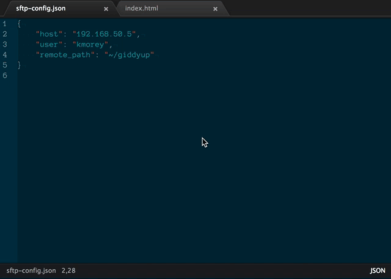

# Secure Copy package

Upload files to a remote server using `scp`

## Keybindings
### OS X

`cmd-shift-u` upload the current file

`cmd-shift-v` upload all files from Git status

### Windows/Linux

`ctrl-shift-u` upload the current file

`ctrl-shift-v` upload all files from Git status

## Remote server mapping

Currently reads Sublime SFTP `sftp-config.json` named files in the current project tree.
Looks for the `host`, `user`, and `remote_path` keys in the JSON object to figure out what
parameters to pass to the `scp` executable.

```json
{
    "host": "my-vm.local",
    "user": "myself",
    "remote_path": "/var/www/mysite"
}
```

## TODO
1. Better configuration rather than rely solely on `sftp-config.json`
2. Configurable `scp` path (needed for win32 support, I think)
3. Better error handling


